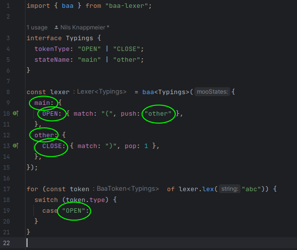

[Original image by lemmling on OpenClipArt.org](https://openclipart.org/detail/17637/cartoon-sheep)

# Baa!

Baa is a highly-optimised tokenizer/lexer written in TypeScript. It is inspired by [moo](https://github.com/no-context/moo)
, but completely rewritten.

It accepts most of moo's configurations, but lacks some features.

- No support for arrays of [keywords](https://github.com/no-context/moo#keywords).
- No support for rules that are arrays of rule definitions.
- No support for regular expressions with unicode flag
- Less dynamic checks (e.g. silently drops all provided regex flags)

Advantages:

- Compiles to a reusable concurrency-save lexer instead of creating an iterable object directly (see "Usage").
- Different token format.
- Slightly faster than `moo` (at least not much slower)
- About 2.2kb of size.
- Strong typings, including state-names and token-types
- Understandable code

_Note: This was mostly an exercise for me to practice test-driven development and think about
architecture a bit. In the end, I tried to optimize speed and build size. I don't think it makes a
lot of difference whether you use `moo` or `baa`. `moo` is more popular and may be better supported in the long run.
I will use `baa` in [handlebars-ng](https.//handlebars-ng.knappi.org) though._

## Usage

The [examples/](examples) show you how to use `baa`. One of the simple examples is this:

```ts
const lexer = baa({
  main: {
    A: "a",
    FALLBACK: { fallback: true },
    B: "b",
  },
});

for (const token of lexer.lex("a b")) {
  console.log(token);
}
```

This will result in the following tokens:

```
{ type: 'A',  original: 'a', value: 'a', start: { line: 1, column: 0 }, end: { line: 1, column: 1 } }
{ type: 'FALLBACK', original: ' ', value: ' ', start: { line: 1, column: 1 }, end: { line: 1, column: 2 } }
{ type: 'B', original: 'b', value: 'b', start: { line: 1, column: 2 }, end: { line: 1, column: 3 } }
```

For a complete list of rules, have a look at [the tests](./src/index.test.ts)

## Using types

If you create a type

```ts
interface Typings {
  tokenType: "my" | "token" | "types";
  stateName: "my" | "state" | "names";
}
```

and pass it as generic to the `baa` function, you will get auto-completion for
types within the configuration as well as for the "type" field in the created tokens.
The following screenshot highlights all places that are type-checked and auto-completed.



## Benchmarks

See [performance/](./performance) for the exact tests and run then yourself with

```
yarn perf
```

These are the results, but be aware that results may vary a lot:

```
 BENCH  Summary

  moo - performance/moo-baa.bench.ts > moo-baa test: './tests/abab.ts' (+0)
    1.07x faster than baa

  baa - performance/moo-baa.bench.ts > moo-baa test: './tests/fallback.ts' (+0)
    1.19x faster than moo

  baa - performance/moo-baa.bench.ts > moo-baa test: './tests/handlears-ng.ts' (+0)
    1.50x faster than moo

  baa - performance/moo-baa.bench.ts > moo-baa test: './tests/handlears-ng.ts' (1)
    1.25x faster than moo

  baa - performance/moo-baa.bench.ts > moo-baa test: './tests/handlears-ng.ts' (2)
    1.19x faster than moo

  baa - performance/moo-baa.bench.ts > moo-baa test: './tests/json-regex.ts' (+0)
    1.15x faster than moo

  moo - performance/moo-baa.bench.ts > moo-baa test: './tests/json.ts' (+0)
    1.04x faster than baa

```

## Readable / Extendable code

What bothered me most about `moo` was that it is just one large JavaScript file,
and it took me a long while to understand all the optimizations they implemented.

It tried to take modular approach. Basically the whole program is divided into

- The Lexer: Responsible for creating an IterableIterator of tokens which then manages state transitions.
  Uses the TokenFactory to create the actual tokens.
- The Matcher: Finds the next token match. There are different strategies
  - RegexMatcher: Creates a large regex to find the next match
  - StickySingleCharMatcher: Uses an array to map char-codes to rules. Can only find single-char tokens,
    but this can be done much faster than with Regex.
- The StateProcessor: Uses the Matcher to find the next match, interleaves matches for fallback
  and error rules.
- The TokenFactory: Keeps track of the current location and creates tokens from matches.
- The `mooAdapter` takes a `moo`-config and combines all those components so that they do what they should.

## Advances usage

You do not have to use the `mooAdapter` though: Most the internal components are exposed, so
you can use them yourself. You can create a `StateProcess` and pass your own `Matcher` instance
to it. You can create a completely new `StateProcessor` with completely custom logic.

The program could also be extended to allow a custom `TokenFactory`, applying the token format that
you need (but I won't do this unless somebody needs it).
